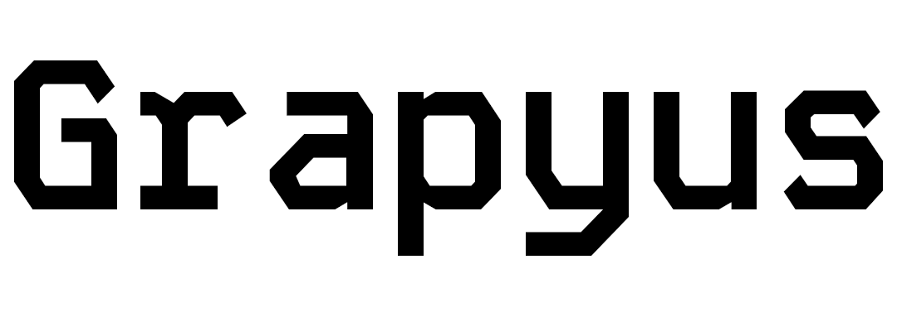

  

  <h2 style="color:#f0f6fc;">A Gradius clone made in Python using pygame</h2>

I did this project at school while getting my vocational training in IT, to learn object oriented programming and hone my python skills, but mostly it was just a way to pass the time during boring classes.

<h3>How to play</h3>
You can just execute <b>Grapyus.bat</b>, which will launch the script using the included python environment.

<h3>Controls</h3>
<b>WASD</b> to move  
<b>SPACE</b> to shoot  
<b>TAB</b> to pause/unpause the game 

